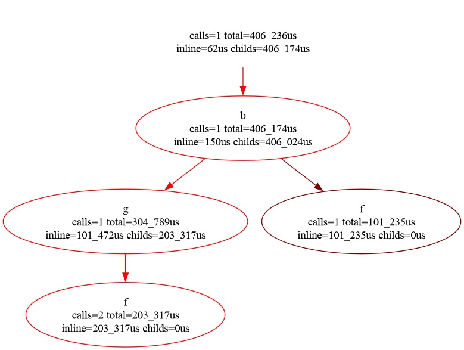

# L_bash_profile: Bash Script Profiler

`L_bash_profile` is a powerful and easy-to-use command-line tool for profiling Bash scripts. It helps you identify performance bottlenecks and understand the execution flow of your scripts, making it an essential tool for both beginner and experienced Bash developers.

## Key Features

- **Deterministic Profiling:** Get a complete and accurate trace of your script's execution.
- **Performance Analysis:** Identify hotspots in your code by analyzing the collected profile data.
- **Multiple Report Formats:**
    - **Top Longest Commands:** See a list of the most time-consuming commands.
    - **Top Longest Functions:** Identify the slowest functions.
    - **Call Graphs:** Visualize the execution flow with `dot` call graphs.
    - **Python-like Profiling:** Generate `pstats` files compatible with Python's profiling ecosystem (e.g., `snakeviz`).
- **Easy to Use:** Simple and intuitive command-line interface.

## Installation

You can install `L_bash_profile` using `uv`:

```bash
uv tool install L_bash_profile
```

Or run it directly without installing:

```bash
uvx L_bash_profile --help
```

## Basic Example

```bash
$ L_bash_profile profile -o ./profile.txt 'i=0; while ((i < 100)); do ((i++)); done'
PROFILING: i=0; while ((i < 100)); do ((i++)); done to ./profile.txt
PROFING ENDED, output in /dev/stdout

$ L_bash_profile analyze ./profile.txt
Top 3 cummulatively longest commands:
  percent    spent_us  cmd                   calls    spentPerCall  topCaller1    topCaller2    topCaller3    example
---------  ----------  ------------------  -------  --------------  ------------  ------------  ------------  ---------
 49.5498        1_596  \(\(i\ \<\ 100\)\)      101          15.802  \> 101                                    \<:7
 48.9289        1_576  \(\(i++\)\)             100          15.76   \> 100                                    \<:7
  1.52127          49  i=0                       1          49      \> 1                                      \<:7

Top 3 cummulatively longest commands per call:
  percent    spent_us  cmd                   calls    spentPerCall  topCaller1    topCaller2    topCaller3    example
---------  ----------  ------------------  -------  --------------  ------------  ------------  ------------  ---------
  1.52127          49  i=0                       1          49      \> 1                                      \<:7
 49.5498        1_596  \(\(i\ \<\ 100\)\)      101          15.802  \> 101                                    \<:7
 48.9289        1_576  \(\(i++\)\)             100          15.76   \> 100                                    \<:7

No functions found
Script executed in 0:00:00.003221us, 202 instructions, 0 functions.
```

## Subcommands

### `profile`
Executes a Bash script and generates a profile file containing the execution trace. It supports different methods (`DEBUG` trap, `XTRACE`, or variable-based) to capture timestamps.

### `analyze`
Analyzes a profile file and generates human-readable reports. It can also output visualization files:
- `--callgraph`: Full execution trace in DOT format.
- `--callstats`: Statistics-based callgraph in DOT format.
- `--pstats`: Python pstats file for use with tools like `snakeviz`.

---

## Real-World Example: Profiling `L_lib.sh`

This example demonstrates profiling complex argument parsing logic within the `L_lib.sh` library.

```bash
$ L_bash_profile profile -o profile.txt 'export L_UNITTEST_UNSET_X=0; . ../L_lib/tests/argparse_uv.sh -n NO --cache-dir CACHE_DIR add --color --no-build-package' -m XTRACE
PROFILING: 'export L_UNITTEST_UNSET_X=0; . ../L_lib/tests/argparse_uv.sh -n NO --cache-dir CACHE_DIR add --color --no-build-package' to profile.txt
PROFING ENDED, output in profile.txt

$ L_bash_profile analyze profile.txt --filterfunction L_argparse --dotlimit 6
Top 20 cummulatively longest commands:
  percent    spent_us  cmd                                                   calls    spentPerCall  topCaller1                            topCaller2                                    topCaller3                              example
---------  ----------  --------------------------------------------------  -------  --------------  ------------------------------------  --------------------------------------------  --------------------------------------  -------------------------------------------------------
  9.19311      38_574  'case "${_L_args[_L_argsi]}" in'                       3195        12.0732   _L_argparse_spec_call_parameter 3132  _L_argparse_spec_parse_args 57                _L_argparse_parse_args_parse_options 5  ../bin/L_lib.sh:8325
  5.1988       21_814  '(( ++_L_argsi < 3140 ))'                              3057         7.13575  _L_argparse_spec_call_parameter 3056  _L_argparse_spec_call_subparser 1                                                     ../bin/L_lib.sh:7141
  4.13206      17_338  '(( 1 ))'                                              2418         7.17039  _L_argparse_spec_call_parameter 2399  _L_argparse_spec_parse_args 19                                                        ../bin/L_lib.sh:8324
  3.94545      16_555  '_L_argparse_spec_call_parameter'                       752        22.0146   _L_argparse_spec_parse_args 733       _L_argparse_spec_call 19                                                              ../bin/L_lib.sh:8295
  3.53363      14_827  '_L_argparse_spec_argument_common'                      753        19.6906   _L_argparse_spec_call_parameter 752   _L_argparse_spec_common_subparser_function 1                                          ../bin/L_lib.sh:7254
  3.45832      14_511  "[[ -n '' ]]"                                          1599         9.07505  _L_argparse_spec_call_parameter 1131  L_var_is_set 427                              _L_argparse_spec_parse_args 38          ../bin/L_lib.sh:1882
  2.65541      11_142  '_L_argparse_spec_call_parameter_common_option_a..      889        12.5332   _L_argparse_spec_call_parameter 889                                                                                         ../bin/L_lib.sh:7171
  2.14873       9_016  'local first_long_option= first_short_option= pc..      752        11.9894   _L_argparse_spec_call_parameter 752                                                                                         ../bin/L_lib.sh:7139
  1.98714       8_338  'case "${_L_args[++_L_argsi]}" in'                      734        11.3597   _L_argparse_spec_parse_args 734                                                                                             ../bin/L_lib.sh:8406
  1.97118       8_271  'case "${_L_opt_action[_L_opti]:=store}" in'            753        10.9841   _L_argparse_spec_argument_common 753                                                                                        ../bin/L_lib.sh:7276
  1.87823       7_881  "[[ '' == remainder ]]"                                 750        10.508    _L_argparse_spec_argument_common 750                                                                                        ../bin/L_lib.sh:7260
  1.8451        7_742  "L_var_is_set '_L_opt_dest[_L_opti]'"                   745        10.3919   _L_argparse_spec_call_parameter 745                                                                                         ../bin/L_lib.sh:7189
  1.77956       7_467  '((  3140 - _L_argsi >= 2 ))'                           753         9.91633  _L_argparse_spec_parse_args 753                                                                                             ../bin/L_lib.sh:8404
  1.67423       7_025  'break'                                                 755         9.30464  _L_argparse_spec_call_parameter 733   _L_argparse_spec_parse_args 19                _L_argparse_spec_call_subparser 1       ../bin/L_lib.sh:8327
  1.58605       6_655  'case "${_L_opt_nargs[_L_opti]:=0}" in'                 753         8.83798  _L_argparse_spec_argument_common 753                                                                                        ../bin/L_lib.sh:7327
  1.5634        6_560  'local _L_type='                                        752         8.7234   _L_argparse_spec_call_parameter 752                                                                                         ../bin/L_lib.sh:7206
  1.52408       6_395  '_L_opt__class[_L_opti]=option'                         745         8.58389  _L_argparse_spec_call_parameter 745                                                                                         ../bin/L_lib.sh:7187
  1.50096       6_298  '(( --_L_argsi ))'                                      753         8.36388  _L_argparse_spec_call_parameter 752   _L_argparse_spec_call_subparser 1                                                     ../bin/L_lib.sh:7141
  1.37823       5_783  '(( 0 ))'                                               755         7.6596   _L_argparse_spec_call_parameter 751   _L_argparse_optspec_validate_values 2         _L_argparse_parse_args_long_option 2    ../bin/L_lib.sh:7243
  1.34105       5_627  '(( ++_L_opti ))'                                       753         7.47278  _L_argparse_spec_parse_args 753                                                                                             ../bin/L_lib.sh:8397

Top 20 cummulatively longest functions:
  percent    spent_us  funcname                                                calls    spentPerCall    instructions    instructionsPerCall  location
---------  ----------  ----------------------------------------------------  -------  --------------  --------------  ---------------------  -------------------------------------------------------
51.682        216_856  _L_argparse_spec_call_parameter                           752       288.372             22857               30.3949   ../bin/L_lib.sh:7139
14.4767        60_744  _L_argparse_spec_argument_common                          753        80.6693             4885                6.48738  ../bin/L_lib.sh:7260
11.4705        48_130  _L_argparse_spec_parse_args                                19      2533.16               4238              223.053    ../bin/L_lib.sh:8323
 9.46885       39_731  _L_argparse_spec_call_parameter_common_option_assign      889        44.6918             2667                3        ../bin/L_lib.sh:7124
 5.33345       22_379  L_is_valid_variable_name                                  752        29.7593              752                1        ../bin/L_lib.sh:2532
 2.02861        8_512  L_argparse                                                  1      8512                    49               49        ../bin/L_lib.sh:8506
 1.86417        7_822  L_var_is_set                                              833         9.39016             833                1        ../bin/L_lib.sh:1882
 0.666592       2_797  _L_argparse_parse_args_set_defaults                         2      1398.5                 334              167        ../bin/L_lib.sh:7974
 0.465685       1_954  _L_argparse_parse_args                                      2       977                   234              117        ../bin/L_lib.sh:8153
 0.316494       1_328  _L_argparse_spec_call_subparser                             1      1328                   136              136        ../bin/L_lib.sh:6874
 0.284082       1_192  _L_argparse_parser_get_long_option                          3       397.333                 6                2        ../bin/L_lib.sh:7373
 0.244282       1_025  L_is_true                                                 103         9.95146             103                1        ../bin/L_lib.sh:2484
 0.232366         975  _L_argparse_parse_args_long_option                          3       325                    39               13        ../bin/L_lib.sh:8005
 0.230698         968  _L_argparse_parse_args_short_option                         1       968                    19               19        ../bin/L_lib.sh:8074
 0.219735         922  _L_argparse_spec_call                                      19        48.5263               57                3        ../bin/L_lib.sh:8294
 0.217828         914  _L_argparse_optspec_dest_store                             46        19.8696               92                2        ../bin/L_lib.sh:7435
 0.160154         672  _L_argparse_spec_subparser_inherit_from_parent             18        37.3333               54                3        ../bin/L_lib.sh:8307
 0.157055         659  _L_argparse_sub_subparser_choices_indexes                   1       659                    76               76        ../bin/L_lib.sh:6956
 0.153481         644  L_array_append                                             36        17.8889               72                2        ../bin/L_lib.sh:3412
 0.13513          567  _L_argparse_optspec_dest_arr_clear                          1       567                     3                3        ../bin/L_lib.sh:7423

Script executed in 0:00:00.419597us, 37891 instructions, 28 functions.
```

## Visualizing Call Graphs

To visualize the execution flow with `xdot`:

```bash
L_bash_profile analyze profile.txt --callstats profile.dot
xdot profile.dot
```



## Contributing

Contributions are welcome! If you find a bug or have a feature request, please open an issue on the [GitHub repository](https://github.com/kamilcuk/L_bash_profile/issues).

## License

This project is licensed under the GPLv3 License. See the [LICENSE.txt](LICENSE.txt) file for details.
